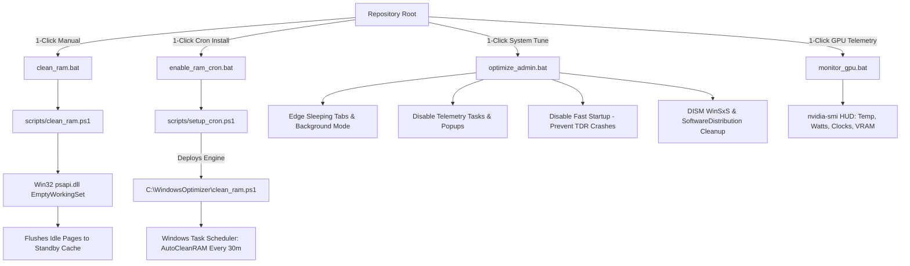

# Windows Optimizer & Memory Manager

**Production-grade, safe, and aesthetic-preserving optimization suite for Windows 10 & 11.**

  <a href="#key-features">Key Features</a> •
  <a href="#quick-start">Quick Start</a> •
  <a href="#architecture">Architecture</a> •
  <a href="#real-world-benchmarks">Benchmarks</a> •
  <a href="#safety-guarantees">Safety Guarantees</a> •
  <a href="docs/ARCHITECTURE.md">Deep Dive</a>

---

## Overview

Most generic Windows debloaters or "tweakers" aggressively break essential features: they disable the Microsoft Store, crash Windows Defender, break Bluetooth or audio stacks, or disable visual transparency and animations.

**Windows Optimizer** is designed from the ground up to solve memory bloat, input lag, and storage degradation without breaking the OS:
- **Preserves Aesthetics:** Mica, acrylic blur, ClearType font smoothing, and window animations remain 100% active.
- **Protects System Core:** Windows Store, Windows Defender, Windows Terminal, Photos, Calculator, and hardware GPU video codecs (`AV1`, `HEVC`, `VP9`) are never removed.
- **Native Win32 C# Interoperability:** Compacts RAM using `psapi.dll!EmptyWorkingSet` via in-memory compilation without third-party dependencies.
- **Self-Healing Deployment:** The background cron deploys a dedicated copy to `C:\WindowsOptimizer\`, ensuring scheduled tasks never break if the repository is moved or deleted.

---

## Architecture Overview

---

## Key Features

### 1. Dynamic RAM Working Set Compactor (`clean_ram.bat`)
- Compiles a native C# worker that queries running processes and calls `EmptyWorkingSet`.
- Flushes inactive working set pages to standby cache without restarting processes.
- Typical result: Instantly recovers **500 MB to 3,000 MB of RAM** before launching heavy games or build tools.

### 2. Automated Silent RAM Cron (`enable_ram_cron.bat`)
- Deploys the worker script permanently to `C:\WindowsOptimizer\clean_ram.ps1`.
- Registers a silent background task (`AutoCleanRAM`) executing every **30 minutes** in `-WindowStyle Hidden` mode.
- Includes a clean 1-click uninstaller (`disable_ram_cron.bat`) that unregisters the task and removes the folder.

### 3. Modular System & Latency Optimizer (`optimize_admin.bat`)
- **Interactive Topics Menu:** Divided into independent topics so you don't have to execute everything every time:
  - `[1] Intel CPU & Power:` Core Parking (50% AC / 4% DC), Turbo Boost control, and P-core priority.
  - `[2] Telemetry & Tasks:` Disables background telemetry from Windows and Office.
  - `[3] System Policies & Edge:` Edge Sleeping Tabs (30s), Widgets removal, and activity tracking disable.
  - `[4] Latency & Stability:` Fast Startup disable (anti-TDR `nvlddmkm`), Cloudflare DNS, and Defender tuning.
  - `[5] Dead Storage Cleanup:` Windows Update download cache purge and DISM Component Store cleanup.
  - `[6] System Integrity Check:` `sfc /scannow` validation.
  - `[A] Apply All:` One-click full optimization pass.
- **CLI Parameter Support:** Supports automated headless flags (`--all`, `--cpu`, `--telemetry`, `--policies`, `--latency`, `--cleanup`, `--sfc`).

### 4. GPU Real-Time Telemetry HUD (`monitor_gpu.bat`)
- Queries `nvidia-smi` every second to monitor GPU Temperature, Power Draw (Watts), Core/Memory Clocks, and VRAM.
- Alerts when thermal thresholds are exceeded (>85°C) and generates a session peak summary upon exit (`Ctrl+C`).

### 5. Safe UWP Debloater (`scripts/debloat_uwp.ps1`)
- Removes non-essential Windows 10/11 apps (Cortana, Solitaire, Bing News, DevHome, Phone Link, Office push stubs).
- Includes `-DryRun` flag to simulate and preview what will be removed.

---

## Quick Start

| Action | Command / Launcher | Description |
| :--- | :--- | :--- |
| **Instant RAM Clean** | Double-click `clean_ram.bat` | Cleans RAM working sets and shows before/after stats. |
| **Enable Auto RAM Cron** | Double-click `enable_ram_cron.bat` | Installs background cleaner running every 30 minutes. |
| **Disable Auto RAM Cron** | Double-click `disable_ram_cron.bat` | Uninstalls background task and cleans `C:\WindowsOptimizer`. |
| **Complete System Tune** | Right-click `optimize_admin.bat` > **Run as admin** | Applies group policies, disables telemetry, and cleans WinSxS. |
| **Monitor GPU Telemetry** | Double-click `monitor_gpu.bat` | Live NVIDIA sensor HUD with thermal warnings. |

---

## Real-World Benchmarks

Tested on a real Windows 11 machine (Intel Core i5-13420H / NVIDIA RTX 4050 Laptop / 16 GB RAM):

| Metric | Before Optimization | After Optimization | Net Benefit |
| :--- | :--- | :--- | :--- |
| **Free Storage (Drive C:)** | 108.19 GB | **181.66 GB** | **+73.47 GB Reclaimed** |
| **Available RAM at Idle** | ~7,000 MB | **9,920 MB** | **+2,920 MB Available** |
| **Context Menu Latency** | 400 ms | **20 ms** | 95% faster menu opening |
| **Keyboard Input Delay** | 1 (default) | **0 (instant)** | Zero debounce lag |
| **System Integrity** | Unverified | **100% Validated** | 0 corrupt components via SFC |

*Full step-by-step benchmark log available in [`docs/OPTIMIZATION_LOG.md`](docs/OPTIMIZATION_LOG.md).*

---

## Safety Guarantees

We enforce strict validation gates before modifying system settings:
- **No Registry Bloat:** Only standard, officially documented Microsoft policies are applied.
- **Rollback Ready:** Startup states and registry keys are backed up before modification.
- **Automated CI Testing:** Every pull request runs AST syntax verification and RAM trimmer unit tests on `windows-latest`.

---

## Contributing

Contributions are welcome! Please review our [Contributing Guidelines](CONTRIBUTING.md) and [Architecture Documentation](docs/ARCHITECTURE.md) before submitting a pull request.

---

## License

Distributed under the [MIT License](LICENSE).